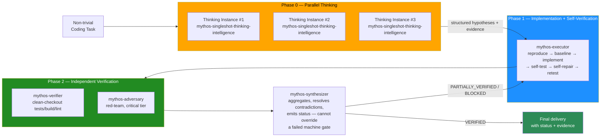

<div align="center">

# Reliability Harness for Grok Build CLI

### Mythos-inspired Multi-Agent Verification Protocol — as a Native Grok Build CLI Plugin

**Independent, evidence-based verification for Grok Build CLI: task contracts, least-privilege sub-agents, clean-checkout verification, and a deterministic done-gate.**

[](https://opensource.org/licenses/MIT)
[](https://x.ai/cli)
[](#how-the-protocol-works)
[](#maintenance)
[](#honest-quality-bounds)

</div>

---

## What This Is

**Reliability Harness for Grok Build CLI** is a native plugin for [xAI's Grok Build CLI](https://x.ai/cli) that applies a mythos-inspired multi-agent verification protocol — least-privilege sub-agents, task contracts, clean-checkout verification, self-verification by the implementer, and a deterministic done-gate.

This is **not** a model swap. This is **not** a jailbreak. This is **not** "1:1 Mythos in the weights". It is a **behavioral priming framework + sub-agent orchestration protocol** that runs entirely inside Grok Build CLI's native plugin system.

> **Hypothesis (binding, honest):** independent, evidence-based verification improves reliability. Empirical validation against a GLM-5.2 baseline is planned, not yet measured.

<div align="center">

### Ratings: Unrated — empirical validation pending

| Dimension | Rating | Basis |
|---|:---:|---|
| Reasoning depth | Unrated | Empirical validation pending |
| Output reliability | Unrated | Empirical validation pending |
| Anti-hallucination | Unrated | Empirical validation pending |
| Ease of install | Unrated | Empirical validation pending |
| Grok integration | Unrated | Empirical validation pending |

</div>

---

## Why "Reliability Harness for Grok Build CLI"?

This plugin brings a mythos-inspired reliability framework to xAI's Grok Build CLI. Grok Build CLI already supports sub-agents natively. This plugin harnesses that capability for a **structured verification protocol** grounded in observable engineering best practices: smallest reversible patch, self-verification, independent clean-checkout verification, and a deterministic done-gate.

### What makes Grok Build CLI a good substrate

- **Native sub-agents** — Grok spawns child sessions with separate context windows, useful for parallel investigation.
- **Plugin system** — `~/.grok/plugins/` with `skills/`, `agents/`, `commands/`, `hooks/`.
- **Frontmatter-based agent definitions** — clean `.md` files with `name`, `description`, `prompt_mode`, `model`, `permission_mode`, `agents_md`. Tool access is governed by `permission_mode` (a Grok named mode), not by a per-agent `tools` list.
- **`task` tool** — programmatic sub-agent invocation with `agent: <name>` parameter.

---

## How the Protocol Works

The protocol runs on non-trivial coding tasks. Routing by complexity/risk is recommended:

| Tier | Trigger | Agents engaged |
|---|---|---|
| `trivial` | Typo / 1-line / value change / comment | Main agent only |
| `normal` | Standard bugfix, small refactor | Main agent + verifier |
| `complex` | Multi-file refactor, schema/API change, deep bug | 2 read-only scouts (parallel) → lead → verifier |
| `critical` | Security-sensitive, concurrency, data-loss risk | complex + adversary |

### The 4-phase pipeline



### Honest overhead

- Minimum per non-trivial task: **7 sub-agent invocations** (3 thinking + executor + verifier + adversary + synthesizer). It is not "roughly 4x overhead".
- Each repair round adds roughly **4 invocations**.
- Maximum 3 loops, then escalate to the user.

### The 5 core sub-agents (native `.md` definitions)

| # | Agent file | Role | Capabilities |
|---|---|---|---|
| 0 | [`agents/mythos-singleshot-thinking-intelligence.md`](./agents/mythos-singleshot-thinking-intelligence.md) | Up to 3× parallel thinking instances. Emits structured hypotheses + evidence. | READ-ONLY |
| 1 | [`agents/mythos-executor.md`](./agents/mythos-executor.md) | Builds the artifact, self-verifies, then hands off. | read, edit, write, bash |
| 2 | [`agents/mythos-verifier.md`](./agents/mythos-verifier.md) | Independent clean-checkout verification. | read, bash (tests/build/lint). NO edit/write. |
| 3 | [`agents/mythos-adversary.md`](./agents/mythos-adversary.md) | Red-team, critical tier. | read, bash (tests/fuzzing). NO edit/write on main. |
| 4 | [`agents/mythos-synthesizer.md`](./agents/mythos-synthesizer.md) | Aggregates and emits status. Cannot override a failed machine gate. | read, grep, glob. NO edit/write/bash. |

Plus 6 optional orthogonal reliability agents: `reliability-scout`, `reliability-spec-critic`, `reliability-test-designer`, `reliability-lead`, `reliability-verifier`, `reliability-adversary` (see `agents/`).

### When the protocol fires (and when it doesn't)

| Task type | Behavior |
|---|---|
| Coding task with substance (logic, refactoring, bug fix, architecture, security) | Full pipeline fires (>=7 invocations) |
| Trivial edit (typo, 1-line fix, value change) | Skipped (main agent only) |
| Pure info questions, read-only research | Skipped |
| Ambiguous ("trivial or not?") | Pipeline fires |

---

## Installation

### Option A — Install as Grok Plugin (Recommended)

```bash
# Clone the plugin into Grok's plugins directory
git clone https://github.com/emco1234/fable-mythos-grok.git ~/.grok/plugins/fable-mythos-grok

# Reload plugins in Grok Build CLI
# Inside Grok TUI, run:
/plugins reload
```

> **How custom agents load in Grok Build CLI:** Per the official docs (`~/.grok/docs/user-guide/16-subagents.md`), Grok auto-discovers agents from `~/.grok/agents/*.md` and roles from `~/.grok/roles/*.toml`, and skills from `~/.grok/skills/<name>/SKILL.md`. Install all three (see [`INSTALLATION.md`](./INSTALLATION.md) Step 2). Verified via `grok inspect`: all 11 agents appear under **Agents** as `user`, alongside Grok's built-ins (`general-purpose`, `explore`, `plan`). The `fable-mythos-modus` skill + `AGENTS.md` additionally shape behavior with the reliability rules (Evaluation Blindness, Auditability, Task Contract, self-verification, Done Gate).

### Option B — Manual Installation

```bash
# 1. Copy the skill
mkdir -p ~/.grok/skills/fable-mythos-modus
cp skills/fable-mythos-modus/SKILL.md ~/.grok/skills/fable-mythos-modus/SKILL.md

# 2. Copy the sub-agent definitions
mkdir -p ~/.grok/agents
cp agents/*.md ~/.grok/agents/

# 3. Merge the global rules (idempotent — managed block)
./scripts/merge-agents.sh   # or see INSTALLATION.md

# 4. Restart Grok Build CLI
```

### Verify Installation

Inside Grok Build CLI TUI:
```
/plugins list
```

You should see `fable-mythos-grok` in the list.

📖 **Full walkthrough:** [`INSTALLATION.md`](./INSTALLATION.md)

---

## Repository Structure

```
fable-mythos-grok/
├── README.md                              ← You are here
├── AGENTS.md                              ← Global rules (Grok reads this)
├── INSTALLATION.md                        ← Install guide (idempotent managed block)
├── LICENSE                                ← MIT
├── plugin.toml                            ← Grok plugin manifest (least-privilege)
├── agents/                                ← Sub-agent definitions (Grok native)
│   ├── mythos-singleshot-thinking-intelligence.md
│   ├── mythos-executor.md
│   ├── mythos-verifier.md
│   ├── mythos-adversary.md
│   ├── mythos-synthesizer.md
│   ├── reliability-scout.md
│   ├── reliability-spec-critic.md
│   ├── reliability-test-designer.md
│   ├── reliability-lead.md
│   ├── reliability-verifier.md
│   └── reliability-adversary.md
├── skills/
│   └── fable-mythos-modus/
│       └── SKILL.md                       ← Reliability-first skill
├── core/                                  ← Runtime core, schemas, ledger, routing
│   ├── runtime-rules.md
│   ├── task-contract.schema.json
│   ├── verification-report.schema.json
│   ├── evidence-ledger.md
│   └── routing.md
├── docs/
│   ├── RELIABILITY-ROADMAP.md
│   ├── EMPIRICAL-BENCHMARK-PLAN.md
│   ├── MYTHOS-SYSTEM-CARD-ANALYSIS.md
│   ├── ANTI-CONCEALMENT.md
│   └── FAQ.md
└── diagrams/
    └── map-pipeline.svg
```

---

## Honest Quality Bounds

| Claim | Status | Basis |
|---|:---:|---|
| Independent verification reduces single-pass errors | Hypothesis | Plausible, not yet measured |
| Multi-option exploration improves path selection | Hypothesis | Plausible, not yet measured |
| Least-privilege agents reduce blast radius | Standard practice | Conventional security hygiene |
| Grok Build CLI natively supports these mechanisms | High | Uses Grok's own `agents/`, `skills/`, `AGENTS.md` |

### What we explicitly do NOT claim

- This is **emulation of observable patterns**, not activation of another model's latent internals.
- Multiple instances of the same model share systematic blind spots — diversity covers random errors, not systematic gaps.
- The protocol reduces errors; it does **not** eliminate them.
- "100% accurate" / "Cybench 100%" / "★★★★★" / "world's most thorough" / "−50–80%" claims that previously appeared here have been **removed as unverified**. Empirical validation against a GLM-5.2 baseline is planned (see `docs/EMPIRICAL-BENCHMARK-PLAN.md`).

---

## FAQ

<details>
<summary><b>Is this affiliated with xAI?</b></summary>

**No.** This is an independent project. "Mythos" is used as a reasoning-pattern label (not a product claim). Grok Build CLI is a product of xAI. This plugin is a third-party integration.

</details>

<details>
<summary><b>Is this "1:1 Mythos in the weights"?</b></summary>

**No.** Only observable behavioral patterns (multi-option exploration, multi-criteria evaluation, auditability, self-verification, independent verification) are transferable. The host model (e.g., GLM-5.2) is what actually runs. Anyone claiming guaranteed error-free output violates Anti-Concealment.

</details>

<details>
<summary><b>Do I need a specific Grok model?</b></summary>

The agents use `model: inherit` — they run on whatever model your Grok session is configured to use. The reasoning patterns are model-agnostic. For best results, use Grok's most capable model.

</details>

---

## Related Projects

- **[fable-mythos-zcode](https://github.com/emco1234/fable-mythos-zcode)** — Sister project for ZCode (GLM-5.2 / ZAI)

---

## License

[MIT](./LICENSE) — use it, fork it, build on it.

---

<div align="center">

*Built on the principle that reliability comes from evidence-based verification — not from claims about which model's patterns are being emulated.*

</div>
