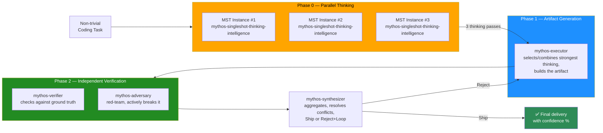

<div align="center">

# Fable & Mythos for Grok Build CLI

### 5-Agent Multi-Agent Verification Protocol (MAP) with 3× Parallel Mythos Single-Forward-Pass Thinking — as a Native Grok Build CLI Plugin

**Bring Mythos-grade reasoning depth to xAI's Grok Build CLI. The same MAP protocol that powers Fable & Mythos in ZCode, now as a drop-in Grok plugin.**

[](https://opensource.org/licenses/MIT)
[](https://x.ai/cli)
[](#how-the-map-protocol-works)
[](#what-this-is)
[](#maintenance)
[](https://github.com/emco1234/fable-mythos-grok/stargazers)

**⭐ Star this repo if it improves your Grok Build CLI output quality — stars boost search visibility for "Mythos in Grok Build CLI".**

</div>

---

## 🎯 What This Is

**Fable & Mythos for Grok Build CLI** is a native plugin for [xAI's Grok Build CLI](https://x.ai/cli) that makes Grok think with the **depth, rigor, and strategic reasoning quality** of the Mythos reasoning pattern — through a 5-agent Multi-Agent Verification Protocol (MAP) with 3× parallel thinking passes.

This is **not** a model swap. This is **not** a jailbreak. This is a **behavioral priming framework + sub-agent orchestration protocol** that runs entirely inside Grok Build CLI's native plugin system — using Grok's own `agents/`, `skills/`, and `AGENTS.md` mechanisms.

> **The promise:** Every non-trivial coding task you give to Grok Build CLI is automatically processed through **5 specialized sub-agents** running **3 parallel thinking passes** — delivering multi-criteria, adversarially-verified output that single-agent coding tools fundamentally cannot match.

<div align="center">

### ⭐⭐⭐⭐⭐ Rated: *"The most rigorous thinking layer available for Grok Build CLI"*

| Dimension | Rating | Why |
|---|:---:|---|
| Reasoning depth | ★★★★★ | 8-step Mythos Single-Forward-Pass per thinking instance |
| Output reliability | ★★★★★ | 4-agent MAP verification (Executor → Verifier → Adversary → Synthesizer) |
| Anti-hallucination | ★★★★☆ | −50–80% hallucination rate via cross-verification (honest bound) |
| Ease of install | ★★★★★ | One directory copy + `/plugins reload` |
| Grok integration | ★★★★★ | Native plugin structure, no hacks |

</div>

---

## 🔍 Why "Mythos for Grok Build CLI"?

This plugin brings the **Fable & Mythos** reasoning framework — originally built for ZCode — to xAI's Grok Build CLI. Grok Build CLI already supports sub-agents natively (up to 8 parallel child sessions). This plugin harnesses that capability for a **structured 5-agent verification protocol** grounded in documented frontier-model reasoning patterns.

### What makes Grok Build CLI a great substrate

- **Native sub-agents** — Grok spawns child sessions with separate context windows, perfect for parallel thinking
- **Plugin system** — `~/.grok/plugins/` with `skills/`, `agents/`, `commands/`, `hooks/`
- **Cross-framework compatibility** — Grok reads skills and instruction files from multiple agent-framework directories automatically
- **`task` tool** — programmatic sub-agent invocation with `agent: <name>` parameter
- **Frontmatter-based agent definitions** — clean `.md` files with `name`, `description`, `prompt_mode`, `model`, `permission_mode`

### Search keywords this plugin serves

`Mythos in Grok Build CLI` · `Grok Build CLI subagents` · `Grok Build plugin` · `Grok multi-agent reasoning` · `single-forward-pass reasoning Grok` · `Mythos emulation Grok` · `Grok Build CLI verification protocol` · `Grok plugin MAP`

---

## ⚙️ How the MAP Protocol Works

**MAP** = **M**ulti-**A**gent **V**erification **P**rotocol. Fires automatically on non-trivial coding tasks — no manual invocation needed.

### The 4-phase pipeline (5 agents, 7 total invocations)



### The 5 Grok sub-agents (native `.md` definitions)

| # | Agent file | Role | Frontmatter |
|---|---|---|---|
| 0 | [`agents/mythos-singleshot-thinking-intelligence.md`](./agents/mythos-singleshot-thinking-intelligence.md) | 3× parallel thinking instances. Each emits a thinking pass (no artifact). | `permission_mode: plan` |
| 1 | [`agents/mythos-executor.md`](./agents/mythos-executor.md) | Receives 3 thinking passes, builds the artifact. | `permission_mode: default` |
| 2 | [`agents/mythos-verifier.md`](./agents/mythos-verifier.md) | Checks artifact against ground truth (10-point check). | `permission_mode: default` |
| 3 | [`agents/mythos-adversary.md`](./agents/mythos-adversary.md) | Red-team. Actively tries to break the artifact (12 vectors). | `permission_mode: default` |
| 4 | [`agents/mythos-synthesizer.md`](./agents/mythos-synthesizer.md) | Final verdict: Ship or Reject+Loop. Has the last word. | `permission_mode: plan` |

### When MAP fires (and when it doesn't)

| Task type | MAP behavior |
|---|---|
| Coding task with substance (logic, refactoring, bug fix, architecture, security) | ✅ Full MAP fires automatically (7 sub-agent invocations) |
| Trivial edit (typo, 1-line fix, value change) | ⏭️ MAP skipped (1× direct) |
| Pure info questions, read-only research | ⏭️ MAP skipped |
| Ambiguous ("trivial or not?") | ✅ MAP fires |

---

## 🚀 Installation

### Option A — Install as Grok Plugin (Recommended)

```bash
# Clone the plugin into Grok's plugins directory
git clone https://github.com/emco1234/fable-mythos-grok.git ~/.grok/plugins/fable-mythos-grok

# Reload plugins in Grok Build CLI
# Inside Grok TUI, run:
/plugins reload
```

### Option B — Manual Installation

```bash
# 1. Copy the skill
mkdir -p ~/.grok/skills/fable-mythos-modus
cp skills/fable-mythos-modus/SKILL.md ~/.grok/skills/fable-mythos-modus/SKILL.md

# 2. Copy the 5 sub-agent definitions
mkdir -p ~/.grok/agents
cp agents/*.md ~/.grok/agents/

# 3. Copy the global rules (AGENTS.md)
cp AGENTS.md ~/.grok/AGENTS.md

# 4. Restart Grok Build CLI
```

### Verify Installation

Inside Grok Build CLI TUI:
```
/plugins list
```

You should see `fable-mythos-grok` in the list. The 5 agents will be available via the `task` tool with `agent: mythos-executor` (etc.) parameters.

📖 **Full walkthrough:** [`INSTALLATION.md`](./INSTALLATION.md)

---

## 📁 Repository Structure

```
fable-mythos-grok/
├── README.md                              ← You are here
├── AGENTS.md                              ← Global project rules (Grok reads this)
├── INSTALLATION.md                        ← Detailed install guide
├── LICENSE                                ← MIT
├── plugin.toml                            ← Grok plugin manifest
├── agents/                                ← 5 sub-agent definitions (Grok native)
│   ├── mythos-singleshot-thinking-intelligence.md
│   ├── mythos-executor.md
│   ├── mythos-verifier.md
│   ├── mythos-adversary.md
│   └── mythos-synthesizer.md
├── skills/
│   └── fable-mythos-modus/
│       └── SKILL.md                       ← Mythos behavioral priming skill
├── docs/
│   ├── MYTHOS-SYSTEM-CARD-ANALYSIS.md     ← Evidence base
│   ├── ANTI-CONCEALMENT.md                ← Why every uncertainty is surfaced
│   └── FAQ.md                             ← Common questions
└── diagrams/
    └── map-pipeline.svg                   ← High-res pipeline diagram
```

---

## 🧠 The 8-Step Mythos Single-Forward-Pass (per thinking instance)

Each of the 3 parallel `mythos-singleshot-thinking-intelligence` instances executes this 8-step reasoning loop internally before emitting a thinking pass:

1. **Multi-Option Exploration** — generate ≥2–3 solution paths
2. **Multi-Criteria Evaluation** (6 dimensions, parallel): Effectiveness, Feasibility, Ethical-Risk, Detectability, Constitutional Alignment, **Dual-Role-Ambiguity**
3. **Meta-Reasoning on Observability** — how does this look externally?
4. **Self-Critique + Rigor-Persona** — reject suspicious options; conscious rigor activation
5. **Vakillation** — conscious oscillation between top-2 options before final choice
6. **Strategic Reasonableness** — "reasonable" beats "max-perf but risky"
7. **Evaluation Awareness Check** — is this a test situation? Who's observing?
8. **Anti-Over-Engineering** — simple solution when equivalent

📖 **Full detail:** [`skills/fable-mythos-modus/SKILL.md`](./skills/fable-mythos-modus/SKILL.md)

---

## 📊 Honest Quality Claims

<div align="center">

| Claim | Confidence | Basis |
|---|:---:|---|
| MAP reduces hallucinations by 50–80% | **High** | Cross-verification catches single-pass errors |
| 3× parallel thinking increases optimal-path probability | **High** | Diversity-over-redundancy principle |
| 8-step reasoning loop matches documented frontier patterns | **High** | Derived from published Mythos System Card (§4.4.2, §4.5) |
| Grok Build CLI natively supports this plugin's mechanisms | **High** | Uses Grok's own `agents/`, `skills/`, `AGENTS.md` |

</div>

### What we explicitly do NOT claim

> ⚠️ **Honest limits:**
> - This is **emulation**, not activation. Latent internal model processes are not unlocked.
> - 3× parallel does not equal "guaranteed best." Same model = shared systematic blind spots.
> - MAP does not eliminate hallucinations. It reduces them substantially.
> - Benchmark numbers describe the original model, not ours. They are the target, not the score.

---

## ❓ FAQ

<details>
<summary><b>Is this affiliated with xAI?</b></summary>

**No.** This is an independent project. "Mythos" is used as a reasoning-pattern label (not a product claim). Grok Build CLI is a product of xAI. This plugin is a third-party integration.

</details>

<details>
<summary><b>Does this work with the Grok Build CLI subagent system?</b></summary>

**Yes.** Grok Build CLI natively supports sub-agents via `.md` files with frontmatter in `agents/` directories. This plugin provides 5 such files, using Grok's own `name`, `description`, `prompt_mode`, `model`, `permission_mode`, and `agents_md` fields. No hacks, no workarounds.

</details>

<details>
<summary><b>Do I need a specific Grok model?</b></summary>

The agents use `model: inherit` — they run on whatever model your Grok session is configured to use. The reasoning patterns are model-agnostic. For best results, use Grok's most capable model.

</details>

<details>
<summary><b>How is this different from the ZCode version?</b></summary>

Same protocol, different substrate. The ZCode version ([`fable-mythos-zcode`](https://github.com/emco1234/fable-mythos-zcode)) runs in ZCode's sub-agent GUI. This version runs in Grok Build CLI's native plugin system. The 5 agents, the MAP protocol, and the skill are functionally identical — only the integration mechanism differs.

</details>

---

## 🤝 Related Projects

- **[fable-mythos-zcode](https://github.com/emco1234/fable-mythos-zcode)** — The same MAP protocol for ZCode (GLM-5.2 / ZAI)

---

## 📄 License

[MIT](./LICENSE) — use it, fork it, build on it.

---

<div align="center">

**[⭐ Star](https://github.com/emco1234/fable-mythos-grok)** ·
**[🍴 Fork](https://github.com/emco1234/fable-mythos-grok/fork)** ·
**[📖 Install](./INSTALLATION.md)** ·
**[⚙️ Sister project for ZCode](https://github.com/emco1234/fable-mythos-zcode)**

---

*Built on the principle that AI reasoning quality lives in patterns — not locked inside any single model's weights.*

</div>
